# 0001. Architecture style and technology stack

- **Status:** Accepted
- **Date:** 2026-09-29
- **Deciders:** Erick

## Context and problem statement

API Store is an e-commerce backend exposed through REST and GraphQL. It is a learning project built on the kind of stack used in production Scala services: Scala, Play, MySQL, and Relate.

The system is divided into six bounded contexts:

- **identity:** sign-up, sign-in, tokens, password reset and change, roles.
- **catalog:** products, stock, prices, and product images.
- **shopping:** each client's cart.
- **ordering:** checkout, orders, and their status lifecycle.
- **payments:** payment intents and Stripe webhooks.
- **notifications:** emails sent in reaction to events.

We need an architecture that:

- can be built and understood by one developer in a short time,
- keeps business rules independent of HTTP, GraphQL, and the database,
- makes it possible to extract a module into a separate service later with limited rework: other modules depend only on its ports, so only the adapter behind each port has to be rewritten,
- uses a realistic production stack, so the skills transfer directly to real projects.

## Decision drivers

- Simplicity of deployment and debugging for a small team.
- Clear module boundaries that can be checked and explained.
- Correctness under concurrency: no overselling when two orders compete for the last unit, and no double processing when a payment event is delivered more than once.
- Learning value: use a production-style stack (Scala, Play, MySQL, Relate) so the skills transfer directly to real projects.
- Ability to evolve: OAuth 2.0, an external identity provider, or a service split later, with limited rework.

## Decision

### Architecture style

- **Modular monolith** with one deployable unit (A10).
- **One sbt project**, with one top-level package per bounded context (A1, A3). Media is part of catalog.
- **Clean/hexagonal layering** inside each context: `domain`, `application` (use cases and ports), and `infrastructure`, which is split into `web` (controllers) and `persistence` (Relate repositories). Controllers and GraphQL resolvers are thin adapters that call use cases (A11).
- **GraphQL is one top-level package**, `graphql`, outside the contexts. It is an adapter, not a module, so it may call the use cases of every context. This lets it link types across contexts, such as an order and its client, without the contexts depending on each other (A11).
- **A `shared` package** holds cross-cutting infrastructure only: configuration, the global error handler and `AppError`, filters and action builders, `Actor` and `Role`, the transaction runner, and the event publisher and outbox poller. It contains no domain concepts.
- **One-way dependencies between contexts (A2).** A context may use code from another context, but never in a circle. Identity, catalog, and payments depend on no other context. Shopping depends on catalog. Ordering depends on catalog, payments, and shopping. Notifications depends on all of them, because it reacts to their events, and nothing depends on notifications.

  

  An arrow means "uses code from". Notifications is drawn apart, with one dotted arrow, because it only reacts to events from the other five.
- **Reversing a dependency when needed.** When a context needs an answer from another context that already depends on it, it defines a small interface and the other context implements it. For example, catalog must not delete a product that is in an unpaid order, but ordering already depends on catalog. So catalog defines `PendingOrderChecker` and ordering implements it. The same idea applies to `shared`: every context may use it, and it uses none of them. For example, `shared` defines a `TokenVerifier` and identity implements it, so no context needs to depend on identity for authentication.
- **Module communication** happens only through small public interfaces and events. Only IDs, plain values, and read models cross a boundary (A12).
- **Reliable events** use the transactional outbox pattern (A8): the event row is written in the same transaction as the change, and a poller delivers it, with idempotent handlers. Each context defines its own event types.
- **Boundary checks** are by convention and code review. An ArchUnit test is an optional extra.

### Data

- **One MySQL database** (InnoDB). Each context's tables share a name prefix, and no table has a database foreign key to another context's table (A5). The contexts refer to each other by ID only, so one of them can be given its own database later. The cost is that the database no longer stops a broken reference, for example an order line pointing to a product that was deleted. That protection now comes from application rules, such as catalog refusing to delete a product that is in an unpaid order (`PendingOrderChecker`). We accept this cost for the benefit of being able to separate databases later.
- **Transactions are explicit.** Every repository call receives the database connection it should use, and a `TxRunner` opens and commits transactions on a dedicated thread pool for blocking database work. Play's main request threads are never blocked by JDBC (A4).
- **Stock changes use one atomic statement.** The update only succeeds if enough stock is left (`stock = stock - ? WHERE id = ? AND stock >= ?`), and the code checks that exactly one row changed. The check and the write happen together under the database's row lock, so two orders can't both take the last unit (A6).
- **IDs.** Primary keys are auto-increment `BIGINT`. Users and orders also have a public UUID, so URLs don't reveal how many exist. A record that belongs to someone else returns 404, so we never confirm it exists, and a role failure on an endpoint returns 403 (A6).
- **Money** is stored as `DECIMAL(12,2)`, so amounts are exact and never rounded the way floating-point numbers are (A5).
- **Lists are paginated** with `LIMIT/OFFSET` and an exact `COUNT(*)` (M5). The exact count gets slower as tables grow, and a production system with very large tables would often avoid it, for example with cursor-based pagination or approximate totals. We keep it because the specification explicitly requires the total count and page information.

### Security (summary)

- **Identity runs inside the application**, behind interfaces, so an external provider such as Keycloak or Amazon Cognito could replace it later without changing the other contexts (I11).
- **Sign-in tokens.** An access token is a short-lived JWT (about 15 minutes, set in configuration). A refresh token is a random value that is stored only as a hash, replaced each time it is used, and sent in an httpOnly cookie that scripts cannot read (I12). The cookie is `SameSite=Strict` and limited to the refresh and sign-out paths, and Play's CSRF protection is on (I2).
- **Ending a session.** Each user has a `token_version`. Signing out or changing the password increases it, and tokens carrying an older version stop working. A list of individually revoked tokens (by their `jti`) is left for a later phase (I1).
- **Passwords** are hashed with Argon2id (I3). Forgot-password always answers 202, whether or not the email exists, so it can't be used to find registered emails (I7). The forgot-password and reset-password endpoints are rate limited with Bucket4j, as the specification requires, and sign-in is rate limited too, to slow down password guessing (I4). The limits are set in configuration.
- **Authorization has two layers.** At the edge, Play action builders check that the caller is signed in and has the right role (403). Inside each use case, an explicit `Actor` (user and role) is checked against the data, for example that an order belongs to the caller (404 if not). The use-case checks are shared by REST and GraphQL, and only the edge checks are adapter-specific (A13).
- **HTTP protections.** Security headers, CORS limited to configured origins (never `*`, because the refresh cookie needs credentials), and the allowed-hosts filter are enabled (I8).
- **OAuth 2.0** is rejected for now and may be added later as an optional extra. Conventions are kept so it can be added cheaply (I9, I10).

### Technology stack

| Concern | Choice | Why |
| --- | --- | --- |
| Language | Scala 2.13.18 with `-Xsource:3`, braces, sealed traits, and implicits (S1) | Relate supports 2.13 only (planned ADR) |
| Web framework | Play 3.0.11 on Pekko (S2) | The framework used by the target stack. |
| Runtime and build | JDK 17, sbt | Supported by Play 3.0.11. |
| Project skeleton | `play-scala-seed.g8` template, sample code removed | The official Play layout. |
| Database | MySQL 8.4 LTS in Docker (S3) | Long-term support release, and the same setup on every machine. |
| Dependency injection | Guice (S4) | Play's default. |
| Database access | Relate 5.1.0 over JDBC and HikariCP, no ORM (S5) | Target stack's library (planned ADR) |
| Migrations | Flyway (S6) | Plain versioned SQL files, without the up/down sections of Play Evolutions. |
| JSON | circe with play-circe (S7) | Widely used in production Scala, and likely what the target stack uses. |
| GraphQL | Sangria (S8) | The standard GraphQL library for Scala. |
| API documentation | Swagger / OpenAPI (S9) | Generated from the routes. |
| Configuration | PureConfig, validated at startup (S10) | The application refuses to start on bad configuration, as the specification requires. |
| Effects and errors | `Future[Either[AppError, A]]` (S11) | Expected failures are values, and the Play stack is `Future`-based. |
| Testing | ScalaTest, scalatestplus-play, testcontainers-scala (S12) | Tests run against a real MySQL. |
| Email | play-mailer with Twirl templates, Mailpit in development (S13) | Emails can be inspected locally without sending them. |
| Image processing | Thumbnailator (S14) | A small library for resizing and creating thumbnails. |
| Caching | Play cache with Caffeine (S15) | In-memory, and cleared when products change. |

## Alternatives considered

- **Microservices from the start.** Rejected: deployment, tracing, and distributed transactions cost too much for this scope. Keeping clean boundaries between contexts is also good practice for a possible migration later, with limited rework.
- **A multi-module sbt build**, with one sbt module per context. Rejected for now: packages give the same separation with less build configuration, and boundaries are kept by convention and review.
- **An ORM or Slick.** Rejected: Relate is the library used by the target stack, and plain SQL keeps transaction and locking behavior visible.
- **A message broker such as Kafka for events.** Not now: it adds infrastructure to run. Events are stored in an outbox table in the same transaction as the change, so none is lost, and a poller delivers them. If a context later becomes its own service, only the poller changes: it forwards outbox rows to a broker such as Kafka, RabbitMQ, or a cloud queue.
- **An external identity provider (Keycloak, Amazon Cognito, or Google Identity Platform) from the start.** Deferred, not rejected: each covers sign-in, tokens, and roles, but none covers our rate limiting on password reset or the password-change email, and it would take over hashing and the reset flow, which this project builds itself. It stays a documented fallback (I11).
- **Cursor-based pagination.** Rejected: the specification requires the total count and page information.
- **Guest carts.** Rejected for now: the specification allows guest or authenticated carts, and authenticated-only carts avoid merging and cleaning up anonymous carts (M12).

## Consequences

**Positive**

- One deployable application and one database, so local development and debugging are simple.
- Business rules can be tested without HTTP, GraphQL, or a database.
- Boundaries between contexts are explicit and can be reviewed.
- The stack matches the target stack, so the practice transfers directly.
- A context or the identity provider can be replaced or extracted later with limited rework, because only the adapters behind the interfaces change.
- Authorization cannot be forgotten by an adapter: every use case that acts for a user requires an `Actor`, so REST and GraphQL share the same checks, and interfaces let rules be tested without a database.

**Negative**

- Boundaries are kept by discipline and code review, not enforced by the build, so they can erode over time. An ArchUnit test could check them later.
- One shared database is a single point of failure and a scaling limit. Without foreign keys between contexts, broken references are prevented by application rules, not by the database.
- Passing an `Actor` and going through interfaces adds some boilerplate to every use case. We accept it in exchange for the safety and testability above.
- Events are delivered at least once and after a short delay. If the application stops after a handler runs but before the event is marked as done, the event is delivered again, so handlers must tolerate duplicates. Other contexts also see changes slightly later.
- Scala 2.13 with `-Xsource:3` is a compromise, not full Scala 3.
- `LIMIT/OFFSET` with an exact count gets slower on very large tables. It is required by the specification and would need revisiting at scale.
