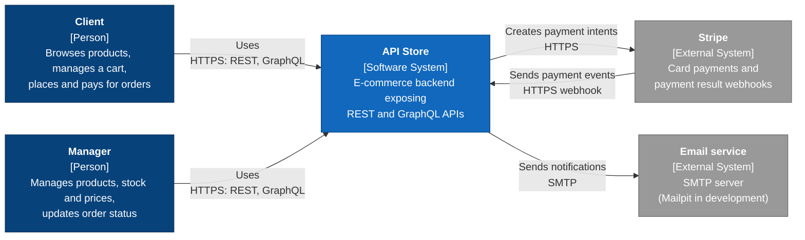

# C4 level 1: System context

This diagram shows API Store as a single box, the people who use it, and the external systems it talks to. Internals are covered at level 2 (containers), added later.

## Elements

| Element | Type | Description |
| --- | --- | --- |
| Client | Person | A shopper who browses products, manages a cart, and places and pays for orders. |
| Manager | Person | Staff who manage products, stock and prices, and update order status. |
| API Store | Software system | The e-commerce backend, exposing REST and GraphQL APIs. |
| Stripe | External system | Handles card payments and sends payment results back as webhooks. |
| Email service | External system | An SMTP server that delivers notification emails. Mailpit is used in development. |

## Notes

- Clients and managers use the API through their own front ends. No front end is part of this system.
- The Stripe webhook is the only inbound call from an external system. It is authenticated by signature verification, not by a user token.
- An OAuth 2.0 identity provider is not shown because OAuth 2.0 is rejected for now. It would appear here as another external system if added later.
- The diagram source is the Mermaid block above (also in `c4-level1-context.mmd`). Regenerate the SVG and PNG when it changes.
